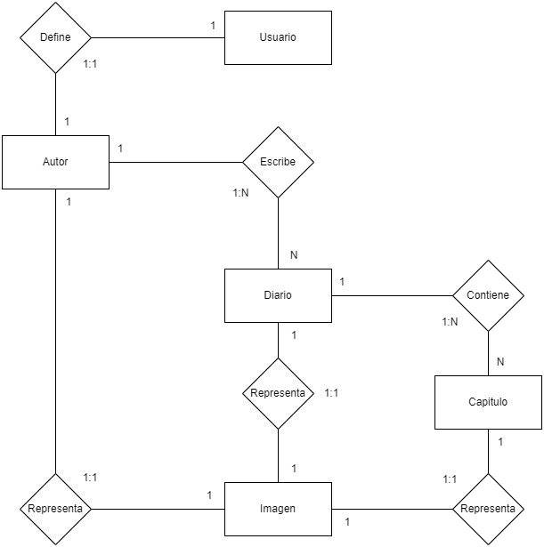

## Proyecto Backend con express.js y PostgreSql: Diary
En este proyecto lo que uiero es contruir una API Rest para poder crear un diario, donde pueda subir día a día mis historias por las que pase en el ranscurso, tenemos, autores, usuarios, diarios, capitulo e imagenes, a continuacion muestro el diagrama ER:

### Tecnologías utilizadas:
- Node.js
- Express.js
- Docker
- PostgreSql
- PgAdmin

### Proyecto futuro: FrondEnd con React.js
Consumir esta API y poder interactuar con ella ya con componentes visuales, implementar un login para que cada persona tenga sus datos de forma privada.
